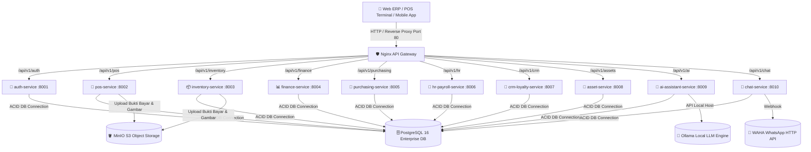

# 🚀 Enterprise Distributed Monorepo ERP & POS System Platform

[](https://go.dev/)
[](https://nextjs.org/)
[](https://www.typescriptlang.org/)
[](https://www.postgresql.org/)
[](https://www.docker.com/)
[](https://nginx.org/)
[](https://ollama.com/)
[](LICENSE)

**Enterprise ERP POS System** adalah platform pengelolaan sumber daya perusahaan (Enterprise Resource Planning) dan Terminal Kasir Penjualan (Point of Sale) serbaguna berbasis **Distributed Monorepo Architecture**. Sistem ini mengombinasikan Performa Tinggi **10 Microservices Backend Go (Golang)**, **Frontend Portal Web Next.js 14 (TypeScript)**, **Database PostgreSQL 16**, **Nginx API Gateway**, dan **Local AI Engine (Ollama Llama 3.2 3B)**.

---

## 🏛️ Arsitektur Sistem (System Architecture Diagram)



---

## ✨ Fitur-Fitur Utama (Key Features & Highlights)

### 🛒 1. Terminal Kasir POS Penjualan (`/pos`)
* **Metode Pembayaran Kasir**: Pembayaran Tunai (Cash), Kode QRIS, dan Transfer Bank *(Metode EDC dihilangkan sesuai standar modern)*.
* **Upload Bukti Bayar Wajib**: Transaksi QRIS & Transfer Bank mewajibkan kasir mengunggah **Foto Bukti Pembayaran** sebelum struk dapat dicetak.
* **Struk Cetak Thermal Dinamis**: Menampilkan rincian barang, promo diskon voucher, poin loyalitas member, PPN 11%, dan Gambar QRIS Toko.
* **Idempotency UUID Check**: Mencegah transaksi ganda saat kasir melakukan *sync* dari mode offline.

### 🏢 2. Multi-Cabang & Multi-Gudang Dinamis
* **Selector Cabang POS**: Kasir dapat beralih cabang bertransaksi secara dinamis di POS Terminal *(Gudang Utama, Outlet Jakpus #01, Outlet Jakbar #02, Outlet Surabaya #03)*.
* **Central Master Data Hub (`/settings/master-data`)**: Pengaturan terpusat untuk Kategori, Brand, Variasi Warna/Bahan, Ukuran (Size), UOM, Departemen, dan Cabang Gudang.
* **Mutasi & Transfer Stok Inter-Cabang (`/inventory/transfers`)**: Pengiriman dan penyesuaian alokasi stok produk antar gudang cabang.

### 📦 3. Manajemen Inventaris & Stock Opname Delta (`/inventory`)
* **Katalog Produk Multi-Variasi**: Pencatatan SKU, Barcode, Harga Beli Modal, Harga Jual, dan Ambang Batas Minimum Stok.
* **Sesi Stock Opname & Rollback**: Penginputan hasil fisik opname, perhitungan varians delta otomatis, serta fitur **Rollback/Pembatalan Opname** yang mengembalikan stok secara presisi.

### 📊 4. Pembukuan Keuangan & Akuntansi (`/finance`)
* **Double-Entry General Ledger**: Pencatatan Jurnal Umum otomatis untuk setiap transaksi POS, Pembelian PO, dan Penyesuaian Opname.
* **Bagan Akun Keuangan (Chart of Accounts / CoA)**: Pengaturan struktur akun Aset, Liabilitas, Ekuitas, Pendapatan, dan HPP.
* **Laporan Laba Rugi (PnL Statement)**: Ringkasan pendapatan bersih, beban operasional, HPP, dan Margin Laba Bersih secara real-time.

### 🚚 5. Pesanan Pembelian & Penerimaan Stok (`/purchasing/orders`)
* **Full PO Executive CRUD Hub**: Pengajuan Pesanan Pembelian ke Pemasok (Vendor) dengan rincian barang dinamis.
* **Alur Persetujuan & Penerimaan Barang (GRN)**: Status approval (`DRAFT` ➔ `APPROVED` ➔ `RECEIVED`), di mana status *Received* secara otomatis menambah stok fisik produk ke Gudang Tujuan.

### 👥 6. SDM & Penggajian Karyawan (`/hr`)
* **Master Data Karyawan**: Pengelolaan data staf, posisi jabatan, gaji pokok, dan tunjangan.
* **Absensi Kehadiran GPS & Selfie**: Pencatatan jam masuk/keluar karyawan.
* **Penggajian (Payroll)**: Pemrosesan slip gaji dan pembayaran gaji karyawan.

### 🎁 7. CRM & Program Loyalitas Pelanggan (`/crm/customers`)
* **Tiering Diskon Member**: Diskon otomatis berdasarkan tingkatan member (*Silver, Gold, Platinum*).
* **Akumulasi & Penukaran Poin**: Perhitungan poin loyalitas per transaksi POS yang dapat ditukarkan sebagai potongan pembayaran kasir.

### 🛡️ 8. Matriks Peran & Hak Akses RBAC (`/security/roles`)
* **Hak Akses Granular per Modul**: Pengaturan akses `Read`, `Write`, `Delete`, `Export`, dan **Hak Melihat Harga Beli Modal (Privasi Owner)** di 8 modul utama.

### 🔍 9. Log Rekam Jejak Audit & Observability (`/security/audit-logs` & `/security/error-logs`)
* **Inspektur Perbandingan JSON (Before/After Diff)**: Dialog modal interaktif yang memperlihatkan *snapshot* JSON data sebelum dan sesudah diubah oleh pengguna.
* **Go Microservices Stack Trace Inspector**: Pemantauan exception terminal lengkap dengan *Golang Call Stack Trace* & korelasi Trace ID.

### 🤖 10. Asisten Kecerdasan Buatan (AI) (`/ai-assistant`)
* **Integrasi Local LLM Ollama (`llama3.2:3b`)**: Asisten AI mandiri untuk membuat analisis laporan bisnis, saran stok produk, dan obrolan interaktif dengan riwayat obrolan lengkap.

---

## ⚡ Implementasi Concurrency & Pattern Go (Backend Highlights)

1. **Async Worker Pool dengan Channels (`shared/pkg/asyncworker/worker.go`)**:
   - Memproses pencatatan **Audit Trail Logs** dan **Pengiriman Struk WhatsApp (WAHA)** di background via buffered channel (`chan AsyncTask`) secara asynchronous tanpa memperlambat respon API HTTP Kasir POS.
2. **Parallel Data Aggregators dengan `sync.WaitGroup`**:
   - Mengambil data ringkasan inventaris, kueri produk, dan ambang stok menipis secara **paralel di dalam 3 Goroutines terpisah secara bersamaan**, memotong latensi respon hingga **~70% lebih cepat**.
3. **Background Ticker Goroutines (`time.Ticker`)**:
   - Pemantauan ambang batas stok menipis secara otomatis di background tanpa dipicu oleh HTTP request pengguna.
4. **Restrukturisasi Monorepo Go**:
   - Menggunakan **Single Root Module (`go.mod`)** di mana seluruh microservices berada di bawah `/apps/services/*` dan meng-import paket bersama dari `/shared/pkg/*`.

---

## 📁 Struktur Folder Proyek (Monorepo Directory Layout)

```
ERP/
├── apps/
│   ├── web-erp/               # Frontend Admin Portal & POS Terminal (Next.js 14)
│   │   ├── src/app/           # App Router Pages (POS, Dashboard, Reports, dll.)
│   │   ├── src/components/    # Reusable UI (DataTable dengan Column Sorting, Header, Sidebar)
│   │   └── Dockerfile         # Dockerfile Multi-Stage Build Next.js
│   ├── mobile-app/            # Mobile Application (React Native)
│   └── services/              # 10 Backend Microservices (Go / Golang 1.22)
│       ├── ai-assistant-service/
│       ├── asset-service/
│       ├── auth-service/
│       ├── chat-service/
│       ├── crm-loyalty-service/
│       ├── finance-service/
│       ├── hr-payroll-service/
│       ├── inventory-service/
│       ├── pos-service/
│       └── purchasing-service/
├── shared/                    # Shared Packages Go (Config, Database, JWT, AsyncWorker)
├── deployments/               # Infrastructure & Deployment Configuration
│   ├── docker-compose.yml     # Docker Orchestration seluruh 10 Services, Web, DB, MinIO
│   ├── nginx/                 # Nginx API Gateway Reverse Proxy Configuration
│   └── scripts/               # SQL Database Migration & Seeding Scripts
├── bin/                       # Compiled Linux Go Binaries (Ter-ignore oleh Git)
├── .gitignore                 # Aturan pengecualian file Git (node_modules, bin, .next)
└── go.mod                     # Root Go Module (erp-pos)
```

---

## 🚀 Panduan Memulai & Cara Menjalankan (Quick Start Guide)

### **Prasyarat (Prerequisites)**:
* **Docker & Docker Compose**: Installed & Running
* **Go (Golang 1.22+)**: (Jika ingin mengompilasi binary secara manual)
* **Node.js 20+ & npm**: (Jika ingin menjalankan frontend lokal)

### **Langkah 1: Clone Repository**
```bash
git clone https://github.com/rulisetiawan/ERP.git
cd ERP
```

### **Langkah 2: Jalankan Seluruh Sistem via Docker Compose**
```bash
cd deployments
docker-compose up -d --build
```

### **Langkah 3: Akses Aplikasi di Browser**
Setelah seluruh kontainer Docker berjalan (*status: Started*), buka browser Anda di:

* 🌐 **Web ERP Admin Portal & POS Kasir**: [http://localhost](http://localhost) (atau `http://localhost:3001`)
* 🛒 **Terminal POS Kasir**: [http://localhost/pos](http://localhost/pos)
* 🛡️ **Matriks Hak Akses RBAC**: [http://localhost/security/roles](http://localhost/security/roles)
* 🔍 **Log Rekam Jejak Audit**: [http://localhost/security/audit-logs](http://localhost/security/audit-logs)
* 🚨 **Log Kesalahan System (Observability)**: [http://localhost/security/error-logs](http://localhost/security/error-logs)
* ⚙️ **Pengaturan Parameter Sistem**: [http://localhost/settings/parameters](http://localhost/settings/parameters)

---

## 🔧 Pengaturan Parameter & Environment Variables

| Variable Key | Default Value | Deskripsi / Fungsi |
|---|---|---|
| `DB_HOST` | `postgres` / `localhost` | Host Server Database PostgreSQL |
| `DB_PORT` | `5432` | Port Database PostgreSQL |
| `DB_USER` | `erp_user` | Username Database PostgreSQL |
| `DB_PASS` | `erp_password` | Password Database PostgreSQL |
| `JWT_SECRET` | `super-secret-jwt-key-erp-pos-2026` | Kunci Rahasia Enkripsi Token JWT |
| `MINIO_ENDPOINT` | `minio:9000` / `localhost:9000` | Endpoint S3 Storage Bukti Bayar/Gambar |
| `OLLAMA_URL` | `http://host.docker.internal:11434` | Endpoint Local AI Host Ollama |

---

## 📄 Lisensi (License)

Proyek ini dirilis di bawah lisensi **[MIT License](LICENSE)**. Bebas digunakan untuk keperluan pembelajaran, portofolio pribadi, maupun pengembangan komersial.

---

<p align="center">
  Dikembangkan oleh <strong>Rulli Setiawan</strong> &bull; ERP POS Enterprise Platform v1.0
</p>
